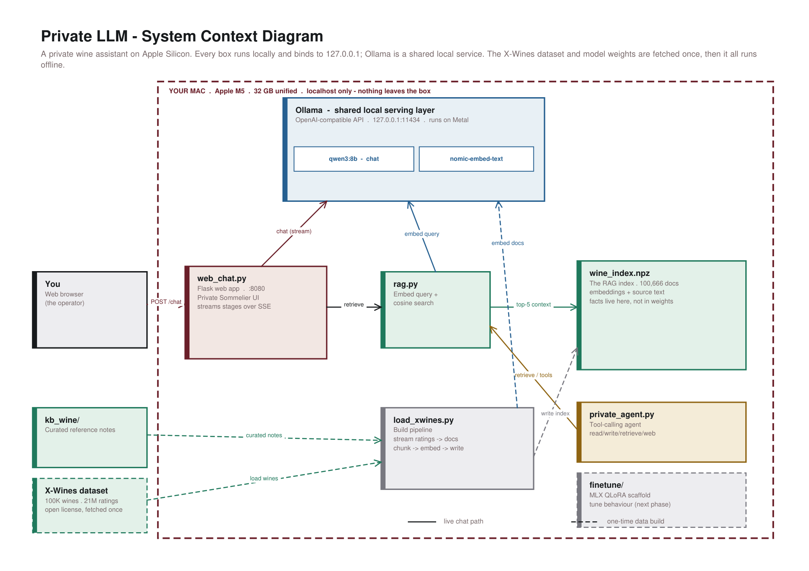
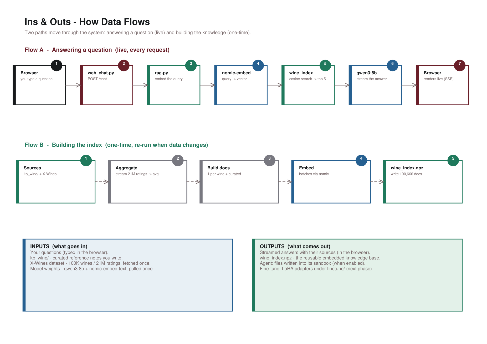

# Private Sommelier — a private LLM wine assistant

A self-contained private LLM platform on **Apple Silicon**. You ask a local model about
wine; it answers grounded in a knowledge base of **100,666 entries**. No cloud, no API key,
nothing leaves your Mac. It mirrors the architecture of a GB10 / DGX Spark "private LLM"
build report — an open model, served locally, driving an app and an agent — scaled down to
a 32 GB Mac.



## What it is

A **sovereignty-first** stack: every component binds to `127.0.0.1`, the model runs on your
own GPU (Metal) through Ollama, and the facts live in a local retrieval layer rather than in
the model's weights. The only outbound step is a one-time download of the open X-Wines
dataset and the model weights — after that it runs fully offline.

## Architecture

`Ollama` is a shared local serving layer; everything else is a small local process.

| Component | Role |
| --- | --- |
| **Ollama** (`:11434`) | Serves `qwen3:8b` (chat) and `nomic-embed-text` (embeddings), OpenAI-compatible, on Metal |
| **`rag.py`** | Embeds the question and does cosine search over the index |
| **`wine_index.npz`** | The embedded knowledge base (100,666 docs) — *facts live here, not in weights* |
| **`web_chat.py`** (`:8080`) | Flask "Private Sommelier" web UI; streams its progress over SSE |
| **`load_xwines.py`** | Builds the index from `kb_wine/` + the X-Wines dataset |
| **`private_agent.py`** | A sandboxed tool-calling agent (read / write / retrieve / web) |
| **`finetune/`** | MLX QLoRA scaffold to tune *behaviour* (the next phase) |

## How data flows



- **Flow A — answering a question (live, every request):** your question is embedded, matched
  against the index, and the top wines become context for the model, which streams an answer
  back to the browser with its sources. You watch each stage live — searching the cellar, the
  wines it found, then the answer being written.
- **Flow B — building the index (one-time):** curated notes and the X-Wines dataset are
  aggregated (21M ratings → averages), turned into one document per wine, embedded in batches,
  and written to `wine_index.npz`.

**Inputs:** your questions · curated `kb_wine/` notes · the X-Wines dataset (once) · model
weights (once). **Outputs:** streamed answers with sources · the reusable `wine_index.npz` ·
agent-written files (when enabled) · LoRA adapters from the fine-tune (next phase).

## Quickstart

Prerequisites: macOS on Apple Silicon, [Ollama](https://ollama.com), and
[uv](https://docs.astral.sh/uv/).

```bash
# 1. serving layer + models (one-time)
brew install ollama && brew services start ollama
ollama pull qwen3:8b && ollama pull nomic-embed-text

# 2. build the wine index (curated base; add X-Wines below for the full 100K)
uv run rag.py ingest --dir ./kb_wine          # quick curated-only index
#   or, the full dataset (downloads X-Wines, ~300 MB, then embeds):
#   see load_xwines.py — uv run load_xwines.py --limit 0

# 3. chat
uv run web_chat.py                            # open http://127.0.0.1:8080
```

The command-line agent is independent of the web app:

```bash
uv run private_agent.py --goal "Recommend a highly-rated Spanish red. Use retrieve."
```

## The two data layers

- **`kb_wine/` — curated reference knowledge.** *How wine works*: regions, grapes,
  classifications, serving, and pairing. Accurate, hand-written, easy to extend.
- **X-Wines — the catalogue.** 100K real bottles with average ratings drawn from 21M reviews,
  loaded by `load_xwines.py`.

Both are embedded into the same index, so one question can pull on reference knowledge and
specific recommendations at once. Update a fact by editing a file and re-indexing — no
retraining, and answers stay auditable against their sources.

## Data & licensing

X-Wines is used under its open research license
([repo](https://github.com/rogerioxavier/X-Wines) ·
[paper](https://www.mdpi.com/2504-2289/7/1/20)). Scraped or paywalled sources (Wine Spectator,
wine.com, Vivino) are deliberately **not** used. Generated artifacts — the index, the X-Wines
CSVs, and the rating cache — are `.gitignore`d and rebuilt locally.

## Sovereignty posture

Every service binds to `127.0.0.1`. Read access and retrieval are on by default; the agent's
`write_file` is opt-in (`--allow-write`, sandboxed) and `fetch_url` is opt-in (`--allow-web`,
the only tool that leaves the box). The web UI is local-only.

## Project layout

```
private_agent.py        sandboxed tool-calling agent (Ollama-backed)
rag.py                  local RAG: embeddings + numpy cosine search
load_xwines.py          load the X-Wines dataset into the index
web_chat.py             Flask "Private Sommelier" web UI (SSE streaming)
kb_wine/                curated wine reference knowledge
kb/                     demo knowledge base for the agent
sandbox/                sample files for the agent's calibration task
finetune/               MLX QLoRA scaffold + behavioural training data
make_context_diagram.py -> Context-Diagram.pdf   (diagram + write-up + flows, 3 pages)
make_howto_pdf.py       -> How-To-Use.pdf
docs/                   rendered diagram images used in this README
```

See **[Context-Diagram.pdf](Context-Diagram.pdf)** for the full three-page pack (context
diagram, a written explanation, and the ins/outs flows) and **[How-To-Use.pdf](How-To-Use.pdf)**
for a printable quickstart.

---

*Built on Apple M5 / 32 GB. Mirrors a GB10 "private LLM" build report, scaled to a Mac.*
